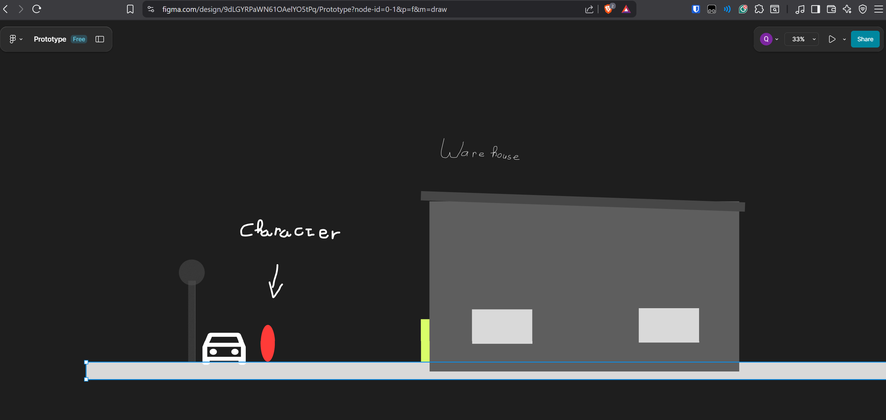
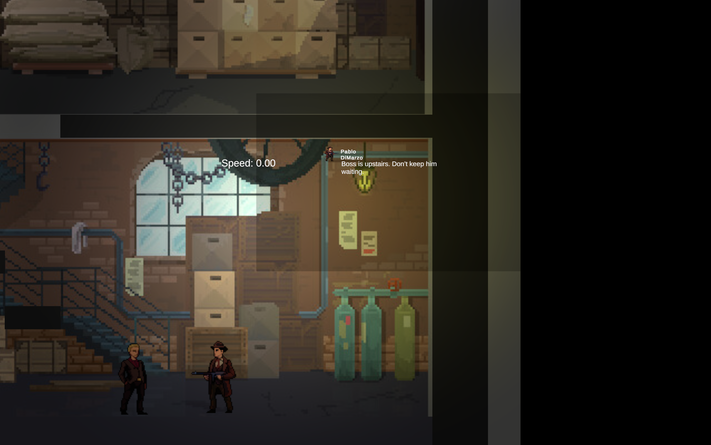

# Mafia's Betrayal

My first real tech project — a simple Unity game prototype created for school.  
This was my first hands-on ICT project, where I learned the fundamentals of coding, game logic, and project structure.

---

### Project Context
- Goal: Learn by building a game from scratch and experiment with coding, design, and iteration.  
- Duration: 4 weeks  
- Key learning areas: C#, Unity, basic game mechanics.

---

### Prototype
- Because this was my first project, it was important for me to create a good prototype
- I made this prototype using Figma

 
  

### Game Concept
- A small-scale game with interactive mechanics  
- Focused on implementing core gameplay features rather than full polish  
- Designed to experiment, learn, and showcase my first development skills

---

### Skills Learned
- Basic C# and Unity coding  
- Game logic and mechanics  
- Project planning and structuring a first ICT project  
- Working with feedback

---

### Tech
C# | Unity  

---

### Code
The source code for the game is included in the `Game` folder.  
It contains the C# scripts I made for player movement, enemies, and menus, etc.

---

### Play the Game

You can play the game I made: [My Game on Itch.io](https://quinny88.itch.io/mafias-betrayal).  
This is the final version I made

---

### Screenshots / Demo
 
*The leaderbord of Mafia's Betrayal*

*A small scene from the game*
